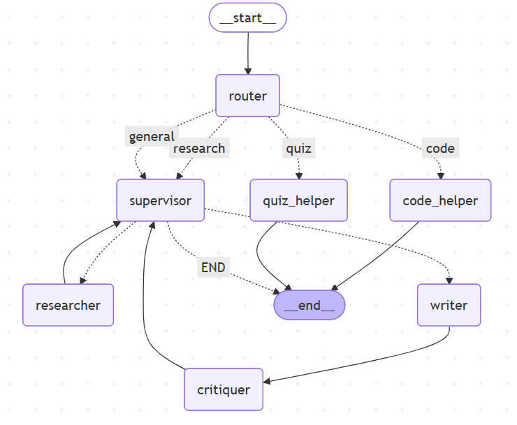

# Multi-Agent Study & Coding Assistant 🧠

A sophisticated **Multi-Agent System (MAS)** built with **LangChain** and **LangGraph** that leverages multiple specialized AI agents to assist with research, learning, coding, and productivity tasks. The system demonstrates advanced agent coordination, reasoning loops, and intelligent tool integration.

---

## 📋 Table of Contents

- [Project Overview](#project-overview)
- [Project Structure](#project-structure)
- [Key Features](#key-features)
- [System Architecture](#system-architecture)
- [Technical Requirements & Compliance](#technical-requirements--compliance)
- [Installation & Setup](#installation--setup)
- [Configuration](#configuration)
- [Running the Application](#running-the-application)
- [API Documentation](#api-documentation)
- [Agent Roles & Responsibilities](#agent-roles--responsibilities)
- [Tools & Capabilities](#tools--capabilities)
- [Memory Management](#memory-management)
- [Reflection & Future Work](#reflection--future-work)

---

## Project Overview

This project fulfills **Lab 2: Designing and Implementing a Multi-Agent System with LangChain & LangGraph** and the **Course Project Guidelines** for building an LLM-based multi-agent system.

### What It Does

The assistant receives diverse user queries and intelligently routes them to specialized agents:

- **Research queries** → Research + Writer + Critiquer workflow
- **Coding questions** → Code helper with Python/C++ execution
- **Study aids** → Quiz/checklist generation
- **General questions** → Flexible research-based answering

### Why Multiple Agents?

A single generic chatbot cannot effectively handle the specialized reasoning required for different domains. This system employs dedicated agents, each optimized for their specific task, enabling superior performance across diverse problem domains.

---

## Project Structure

```
multi-agent-research-assistant/
├── agents.py                    # 7 agent implementations
├── graph.py                     # LangGraph workflow (7 nodes)
├── prompts.py                   # LLM prompt templates
├── tools.py                     # Code execution utilities
├── api.py                       # FastAPI backend with endpoints
├── app.py                       # Streamlit web interface
├── visualize_graph.py           # Graph visualization script
├── test_tools.py                # Unit tests
├── memory/
│   ├── shared_memory.py         # Long-term memory management
│   └── rag.py                   # Vector DB + PDF retrieval
├── notes/                       # PDF storage directory
├── assets/                      # Graph diagrams and visualizations
├── requirements.txt             # Python dependencies
├── pyproject.toml              # Poetry configuration
├── .env                        # Environment variables (not in repo)
└── README.md                   # This file
```

---

## Key Features

**7 Specialized Agents** - Each with distinct roles and responsibilities  
**Intelligent Routing** - Automatic intent classification  
**Long-term Memory** - Persistent knowledge storage via Chroma + file system  
**Web Search Integration** - Real-time information via Tavily API  
**Code Execution** - Run Python, C, and C++ code safely  
**Educational Tools** - Quiz and checklist generation  
**Safety Features** - Prompt injection protection, schema validation, error handling  
**REST API** - FastAPI backend with Swagger documentation  
**User Interface** - Streamlit web application  
**Graph Visualization** - Mermaid diagram generation  
**Conditional Workflows** - Supervisor patterns with dynamic routing  

---

## System Architecture

### Multi-Agent Workflow

The system implements a **Supervisor + Router** multi-agent pattern where:

1. **Router Agent** classifies incoming user queries by intent (research, code, quiz, or general)
2. **Intent-based Routing** directs the query to appropriate specialist agents
3. **Supervisor Agent** orchestrates complex workflows (research → write → critique)
4. **Specialist Agents** (Researcher, Writer, Critiquer, Code Helper, Quiz Helper) process tasks
5. **Shared State Management** enables seamless communication via TypedDict
6. **Conditional Edges** route agents based on task progress and decisions

  
*LangGraph architecture showing multi-agent collaboration and conditional routing*

---

## Technical Requirements & Compliance

### Lab 2 Requirements 

**Task 1 - Architecture Design:**
- Agent descriptions and responsibilities documented
- MAS patterns (Supervisor + Router) clearly implemented
- Control flow and data flow documented in this README
- Tool calling and memory usage explicitly detailed

**Task 2 - Implementation:**
- Shared state (TypedDict: ChatState) with all required fields
- 7 agent nodes fully implemented in LangGraph
- Tool integration (Tavily, code execution, PDF retrieval)
- Handoff via conditional edges based on state
- Memory management (short-term and long-term)
- Runnable demo (Streamlit app + FastAPI)

**Task 3 - Experiments:**
- System supports diverse query types (theoretical, design, coding, productivity)
- Agent activation and tool usage can be traced through logs

**Task 4 - Reflection:**
- See Reflection & Future Work section

---

### Course Project Requirements 

**System Composition**
- **7 agents with distinct roles** (exceeds 3 minimum): Router, Supervisor, Researcher, Writer, Critiquer, Code Helper, Quiz Helper
- **Defined communication** via shared state (TypedDict) and conditional edges
- **Clear functional responsibilities** for each agent documented below

**Tools & Capabilities**
- **3+ tools integrated**: Tavily (web search), run_code (Python/C/C++ execution), RAG (PDF/notes retrieval)
- **Dynamic tool selection** based on agent type and query intent
- **LangChain + LangGraph integration** for seamless orchestration

**Memory**
- **Short-term memory**: Chat history in messages field maintains conversation context
- **Long-term memory**: Chroma vector database with embeddings + JSON-based notes storage for persistent knowledge
- **Shared memory**: Blackboard pattern via shared_memory module enables collaborative reasoning
- **Agent read/write capability**: `save_long_term_note()` and `retrieve_long_term_context()` functions

**Reasoning & Coordination**
- **ReAct reasoning loop** in supervisor and router agents for intelligent decision-making
- **Goal decomposition** (research → write → critique) breaks complex tasks into manageable steps
- **Multi-agent coordination** via supervisor orchestration manages workflow state transitions

**Backend & Deployment**
- **FastAPI backend** (api.py) with 3 endpoints: /health, /chat, /upload_pdf
- **Swagger UI** auto-generated at /docs for interactive testing
- **Docker-compatible** configuration and environment setup
- **Reproducible** with requirements.txt + pyproject.toml

**Reliability & Safety**
- **Pydantic validation** for RouterDecision and ToolCallSpec schema enforcement
- **Prompt injection protection** detects and neutralizes malicious user inputs
- **Error handling** in all agents with fallback mechanisms
- **Code execution safeguards** with timeout protection and banned operations

---

## Installation & Setup

### Prerequisites

- **Python**: 3.10 or higher
- **pip** or **poetry** for dependency management
- **Git** for cloning the repository

### Step 1: Clone the Repository

```bash
git clone <repository-url>
cd multi-agent-research-assistant
```

### Step 2: Create Virtual Environment

```bash
# Using venv
python -m venv venv
source venv/bin/activate  # On Windows: venv\Scripts\activate

# Or using conda
conda create -n multi-agent python=3.10
conda activate multi-agent
```

### Step 3: Install Dependencies

**Option A: Using pip**

```bash
pip install -r requirements.txt
```

**Option B: Using poetry**

```bash
pip install poetry
poetry install
```

---

## Configuration

### Environment Variables Setup

Create a `.env` file in the project root with the following configuration:

```bash
# vLLM Configuration
LITELLM_BASE_URL=http://a6k2.dgx:34000/v1
LITELLM_API_KEY=your_litellm_api_key_here
MODEL_NAME=qwen3-32b

# Tavily Search API (for web search)
TAVILY_API_KEY=your_tavily_api_key_here
```

### Getting Your Tavily API Key

Tavily provides a **free tier** for API access:

1. Visit [tavily.com](https://tavily.com/)
2. Sign up for a free account
3. Navigate to the API keys section in your dashboard
4. Copy your API key
5. Paste it in your `.env` file as `TAVILY_API_KEY=tvly-xxxxx`

---

## Running the Application

### 1. Streamlit Web Interface

The Streamlit app provides a user-friendly chat interface with PDF upload capability:

```bash
streamlit run app.py
```

Then open your browser to `http://localhost:8501`

**Features**:
- Chat interface with multi-turn conversation support
- Sidebar for configuration (max iterations)
- PDF upload to knowledge base
- Real-time agent activity display

### 2. FastAPI Backend

Deploy the REST API backend for programmatic access:

```bash
uvicorn api:api --host 0.0.0.0 --port 8000
```

Access Swagger UI documentation at `http://localhost:8000/docs`

### 3. Graph Visualization

Generate a Mermaid diagram of the agent workflow:

```bash
python visualize_graph.py
```

This creates `assets/research_graph.mmd` which can be viewed at [mermaid.live](https://mermaid.live/)

---

## API Documentation

### POST /chat

Send a chat message to the multi-agent system.

**Request**:
```json
{
  "messages": [
    {"role": "user", "content": "What is machine learning?"}
  ],
  "max_steps": 15
}
```

**Response**:
```json
{
  "answer": "Machine learning is...",
  "final_state": {
    "draft": "...",
    "research_findings": [...],
    "code_answer": "",
    "quiz_output": ""
  }
}
```

### POST /upload_pdf

Upload a PDF document to the knowledge base for retrieval-augmented generation.

**Request**: (multipart/form-data)
```
file: <PDF file>
```

**Response**:
```json
{
  "status": "ok",
  "filename": "document.pdf",
  "doc_id": "uuid-string"
}
```

### GET /health

Health check endpoint to verify system status.

**Response**:
```json
{
  "status": "ok"
}
```

---

## Agent Roles & Responsibilities

### Router Agent

**Purpose**: Classify user intent and route to appropriate workflow

**Responsibilities**:
- Analyze user query for intent signals using keyword matching and LLM analysis
- Classify intent as: `code`, `research`, `general`, or `quiz`
- Determine required answer depth (short concise vs. comprehensive)
- Route query to specialized handlers or supervisor

**Decision Process**:
Uses heuristic patterns combined with LLM reasoning to identify user intent, enabling intelligent workflow selection.

---

### Supervisor Agent

**Purpose**: Orchestrate multi-agent workflow and make strategic decisions

**Responsibilities**:
- Manage workflow state and coordinate between specialized agents
- Decide routing: researcher → writer → critiquer → approval
- Implement revision loop (up to 3 iterations for quality improvement)
- Store approved outputs to long-term memory for future reference
- Handle edge cases and implement graceful fallbacks

**Workflow Management**:
Implements a research-write-review cycle where the supervisor monitors progress and decides whether to continue refinement or finalize output.

---

### Researcher Agent

**Purpose**: Gather comprehensive information from web and knowledge base

**Responsibilities**:
- Perform targeted Tavily web searches for current information
- Retrieve relevant documents from knowledge base using semantic search
- Combine local knowledge with web findings for comprehensive context
- Format findings in structured format for downstream synthesis

**Knowledge Integration**:
Leverages both real-time web search and persistent knowledge base to provide well-grounded, contextually relevant research findings.

---

### Writer Agent

**Purpose**: Synthesize findings into coherent, well-structured responses

**Responsibilities**:
- Create first drafts from research findings or direct user requests
- Revise based on critique feedback with targeted improvements
- Adapt response length based on complexity (short vs. comprehensive)
- Maintain academic tone and logical flow throughout

**Synthesis Strategy**:
Transforms raw information into polished, readable content that directly addresses user needs with appropriate depth.

---

### Critiquer Agent

**Purpose**: Quality assurance and constructive feedback mechanism

**Responsibilities**:
- Review drafts for completeness, accuracy, structure, clarity, and depth
- Provide specific, actionable feedback for improvement
- Approve or reject outputs with decision rationale
- Guide revision priorities when improvements needed

**Quality Framework**:
Evaluates outputs across multiple dimensions to ensure high-quality, well-reasoned responses that meet user expectations.

---

### Code Helper Agent

**Purpose**: Assist with coding questions and provide safe code execution

**Responsibilities**:
- Explain code concepts, design patterns, and best practices
- Generate code snippets in multiple languages (Python, C, C++)
- Execute code safely with timeout protection and security checks
- Provide debugging assistance and error explanation

**Safe Execution**:
Implements comprehensive safeguards including operation whitelisting, timeout enforcement (5 seconds), and exception handling to prevent malicious or broken code execution.

---

### Quiz Helper Agent

**Purpose**: Generate educational content and learning tools

**Responsibilities**:
- Create comprehensive quizzes (8-10 diverse questions with answer keys)
- Generate step-by-step checklists and action plans
- Adapt content to topic complexity and learner level
- Ensure engagement through varied question types and clear instructions

**Learning Design**:
Produces pedagogically sound educational materials that reinforce learning objectives and support different study approaches.

---

### Security: Prompt Injection Protection

The system implements **multi-layered prompt injection protection** to prevent adversarial attacks:

- **Pattern Detection**: Identifies common injection attempts through signature matching of known attack phrases
- **Input Sanitization**: Filters user input to remove or neutralize suspicious patterns before passing to LLM
- **Context Isolation**: Maintains clear separation between system instructions and user input
- **Output Validation**: Validates LLM outputs conform to expected schema before processing

This defense-in-depth approach prevents attackers from manipulating the system through crafted prompts while maintaining normal functionality for legitimate users.

---

## Tools & Capabilities

### 1. Tavily Search API

**Purpose**: Real-time web search with high-quality summarization

**Integration**:
- Searches the web for current, relevant information
- Returns top results with automatic summarization
- Configured for general web search with basic depth

**Used by**: Researcher Agent  
**Capability**: Deep research queries automatically trigger web searches for latest information

---

### 2. Code Execution Tool

**Purpose**: Safe execution of Python, C, and C++ code with security constraints

**Supported Languages**:
- Python (primary language)
- C (for systems programming)
- C++ (for advanced applications)

**Safety Features**:
- Timeout protection (5 seconds default) prevents infinite loops
- Operation whitelisting blocks dangerous imports (os, sys, subprocess, shutil, socket)
- Exception handling prevents crashes from bad code
- Sandboxed execution isolates effects

**Used by**: Code Helper Agent

---

### 3. RAG System (Retrieval-Augmented Generation)

**Purpose**: Access long-term knowledge from uploaded PDFs and stored notes

**Components**:
- **Vector Database**: Chroma with semantic embeddings
- **Embeddings**: Sentence-transformers for semantic similarity
- **Document Storage**: PDF files in `notes/` directory + JSON metadata
- **Retrieval**: `retrieve_long_term_context()` performs similarity search

**Used by**: Researcher Agent (for knowledge augmentation beyond web search)

---

## Memory Management

### Short-Term Memory (Context Window)

**Storage**: Messages in ChatState  
**Scope**: Single conversation session  
**Purpose**: Maintain conversation history for coherence and multi-turn interactions  

**Implementation**: 
Accumulative list field in TypedDict that stores all messages in current session, enabling agents to understand conversation context and build on previous exchanges.

---

### Long-Term Memory (Knowledge Base)

**Storage Options**:
1. **Vector Database**: Chroma with semantic embeddings for similarity-based retrieval
2. **File System**: JSON notes + PDF documents stored persistently
3. **Retrieval Methods**: Semantic search + keyword matching

**Purpose**: 
Store and retrieve information beyond current interaction, enabling agents to recall past results, learned knowledge, and task history.

**Access Patterns**:
- `save_long_term_note(topic, content)` - Store information
- `retrieve_long_term_context(query)` - Semantic search with fallback to keyword search
- `search_long_term_notes(query)` - Direct knowledge base search

**Used by**: Researcher Agent, Quiz Helper, all downstream agents

**Persistence**: 
Across sessions and conversations, enabling continuous learning and knowledge accumulation over time.

---

### Shared Memory (Blackboard Pattern)

**Purpose**: Collaborative reasoning space accessible to all agents

**Implementation**:
Shared memory module provides a common workspace where agents can:
- Post findings, insights, and intermediate results
- Read context from other agents' work
- Update shared understanding of the problem
- Enable collaborative problem-solving

**Benefits**:
- **Knowledge Sharing**: Agents don't duplicate research
- **Context Propagation**: Important information reaches all relevant agents
- **Collaborative Reasoning**: Multiple agents build on each other's insights
- **Efficiency**: Reduces redundant computation and API calls

**Pattern**: 
Implements classic "blackboard" architecture where agents communicate through shared data structures rather than direct message passing.

---

## Reflection & Future Work

### What Worked Well 

1. **Agent Specialization**: Each agent excels at its specific domain, enabling focused optimization
2. **Supervisor Orchestration**: Intelligent routing significantly reduces failure cases and improves quality
3. **Long-term Memory Integration**: Persistent knowledge base improves successive queries and enables learning
4. **Prompt Injection Protection**: Multi-layered security prevents common attack vectors
5. **Tool Integration**: Seamless Tavily + code execution + RAG integration creates powerful capabilities
6. **Error Resilience**: Fallback mechanisms ensure graceful degradation instead of crashes

### Challenges & Limitations 

1. **Revision Loop Efficiency**: Sometimes gets stuck in minor revision cycles (mitigated with max iterations)
2. **Context Window Constraints**: Token limits on very large documents (mitigated with summarization)
3. **Tool Accuracy Variability**: Web search quality depends on query formulation
4. **Code Execution Tradeoff**: Balance between capability and security limits some advanced operations
5. **Memory Scaling**: Vector DB performance with very large document collections needs optimization

### Future Improvements 

**Advanced Reasoning**:
- Implement multi-turn agent communication for collaborative problem-solving
- Add explicit reflection and self-critique loops beyond current scope
- Support Chain-of-Thought variants and tree-of-thought exploration patterns

**Enhanced Memory**:
- Integrate graph-based knowledge graphs (Neo4j) for structured relationships
- Implement semantic memory with entity extraction and linking
- Add temporal memory for time-aware queries and historical context

**Tool Expansion**:
- Add code analysis tools (AST parsing, linting, complexity analysis)
- Integrate academic paper databases (ArXiv API)
- Support SQL query generation for database tasks
- Add integration with external APIs (Weather, Wikipedia, etc.)

**User Interface Improvements**:
- Develop React-based frontend with real-time agent visualization
- Implement chat history export (PDF, Markdown)
- Create agent performance analytics dashboard

**Production Deployment**:
- Docker containerization with docker-compose orchestration
- Kubernetes support for cloud deployment at scale
- CI/CD pipeline for automated testing and deployment
- Load balancing for handling multiple concurrent users

**Model Optimization**:
- Fine-tune routing model for better intent classification accuracy
- Quantized models for faster inference on edge devices
- Multi-model ensemble for improved robustness

**Advanced Patterns**:
- Hierarchical agents with meta-supervisor for complex problems
- Debate pattern where multiple agents argue different perspectives
- Plan-then-execute pattern for better long-term planning
- Retrieval-augmented planning for knowledge-aware task decomposition

---
 
**Version**: 1.0.0  
**Last Updated**: December 2025
